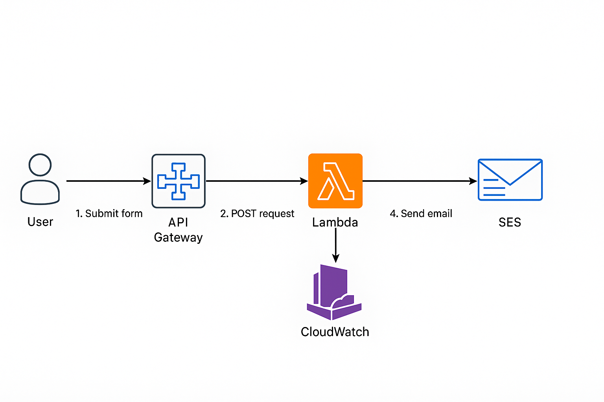
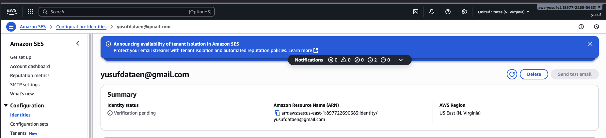
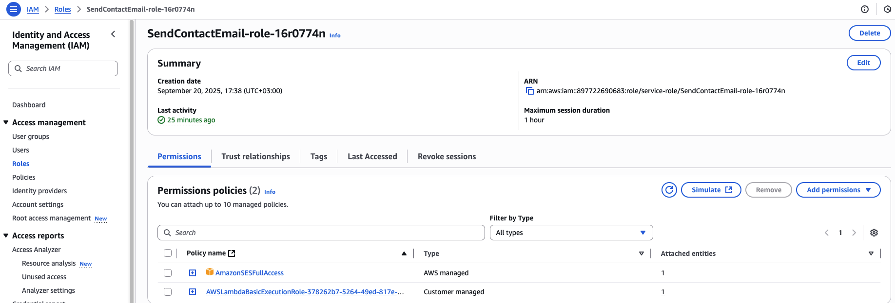
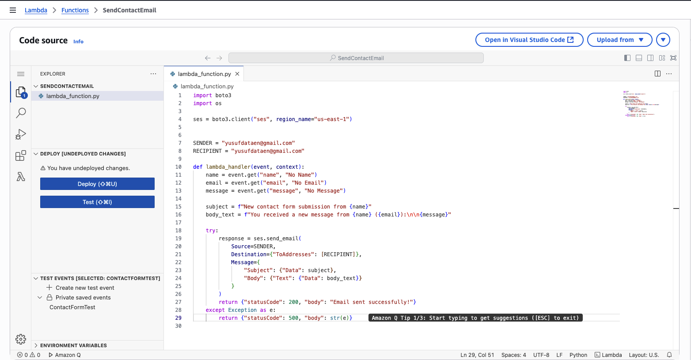
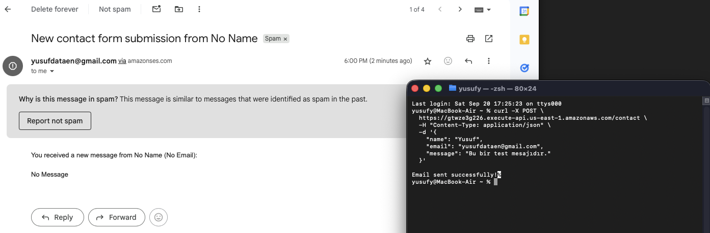
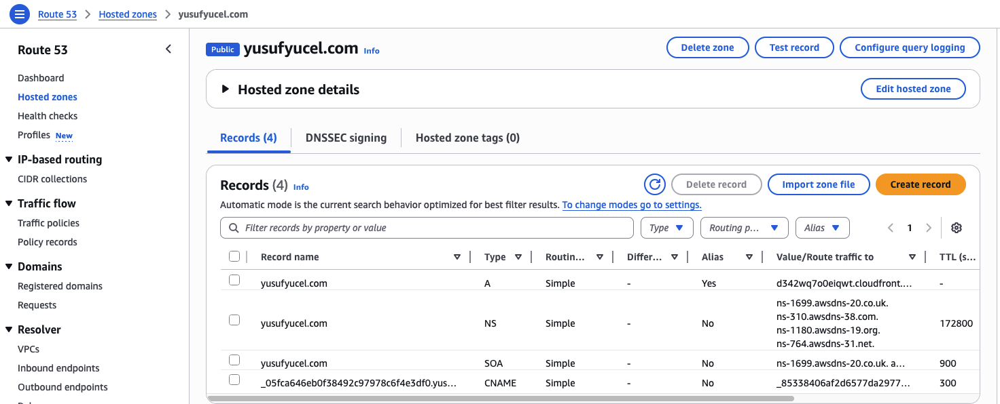
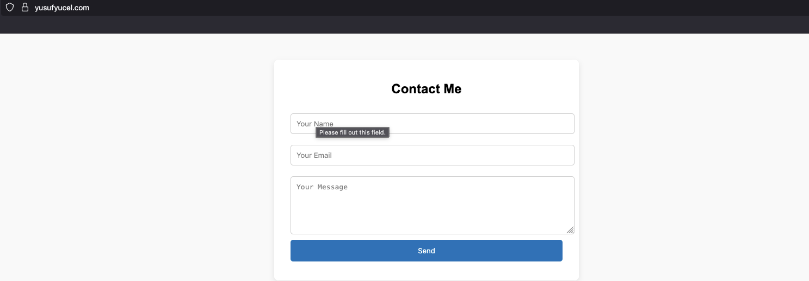

aws-serverless-contact-form/
│
├── lambda/
│   └── index.js            # Lambda function code
├── screenshots/            # Documentation images
│   ├── ses.png
│   ├── iam.png
│   ├── lambda.png
│   ├── apigateway.png
│   ├── cors.png
│   ├── curltest.png
│   └── architecture.png
└── README.md

# 📧 AWS Serverless Contact Form

This project demonstrates how to build a **serverless contact form backend** entirely on AWS, without managing any servers.  
It integrates multiple AWS services to process form submissions securely and deliver emails directly to a verified address.

---

## ⚡ Architecture

**Workflow:**
1. User submits the form on the website.  
2. API Gateway receives the POST request.  
3. Lambda function validates and processes the input.  
4. Lambda uses **AWS SES** to send an email.  
5. CloudWatch logs every execution for monitoring.  

---

## 🛠 AWS Services Used

### ✅ Amazon Simple Email Service (SES)
- Verified sender/receiver email identity.  
- DNS validation completed in Route 53.  
- Configured to send emails within SES sandbox (only verified emails allowed).  

### ✅ AWS Lambda
- Written in **Node.js** to process incoming POST requests.  
- Sends formatted email through SES.  
- IAM execution role attached with:
  - `AmazonSESFullAccess`
  - `AWSLambdaBasicExecutionRole`

### ✅ Amazon API Gateway
- Created a **REST API** with `POST /contact`.  
- Integrated directly with Lambda function.  
- Enabled **CORS** to allow cross-origin requests from the frontend.  
- Auto-deployment enabled on `$default` stage.

### ✅ AWS Identity and Access Management (IAM)
- Created an execution role for Lambda.  
- Permissions attached:
  - `logs:CreateLogGroup`
  - `logs:CreateLogStream`
  - `logs:PutLogEvents`
  - `ses:SendEmail`, `ses:SendRawEmail`

### ✅ Amazon CloudWatch
- Monitors and logs Lambda executions.  
- Used for debugging email delivery issues.  

---

## ⚙️ Steps I Followed

1. **Configured SES**
   - Verified email identity.  
   - Added DNS records in Route 53.  
   - Confirmed verification via email link.  
   

2. **Created IAM Role**
   - Execution role for Lambda with SES + CloudWatch permissions.  
   

3. **Developed Lambda Function**
   - Node.js function to send emails via SES.  
   - Deployed directly from AWS Console.  
   

4. **Setup API Gateway**
   - Defined `POST /contact` route.  
   - Integrated with Lambda.  
   - Enabled CORS: `*` origin, `POST` method, `content-type` header.  
   

5. **Testing the Contact Form**
   - I tested the API Gateway endpoint using `cURL`.  
   - The Lambda function was triggered and the email was successfully delivered through **Amazon SES**.  
   - The screenshot below shows both the terminal output and the received email example.  
   

6. ## Amazon Route 53
- Hosted Zone was configured for the custom domain **yusufyucel.com**.  
- DNS validation records were added for Amazon SES, allowing emails to be sent using the same domain.  
- This setup not only enables static website hosting but also ensures that outgoing emails use a professional domain identity.  

✅ Outcome

-A fully serverless contact form backend deployed on AWS.
-Scalable, cost-efficient, and requires no server management.
-Emails successfully delivered through Amazon SES.

🔗 Resources

-Amazon SES Documentation = https://docs.aws.amazon.com/ses/
-AWS Lambda Documentation = https://docs.aws.amazon.com/lambda/
-Amazon API Gateway Documentation = https://docs.aws.amazon.com/apigateway/
